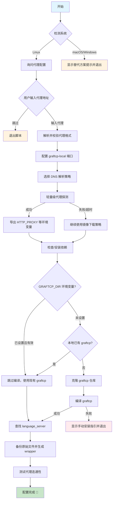

# 反重力代理配置工具

为 反重力 Agent 配置代理，解决网络连接问题。

## 系统支持

| 系统        | 支持情况 | 说明                                                                          |
| ----------- | -------- | ----------------------------------------------------------------------------- |
| **Linux**   | 支持     | 使用 graftcp 自动代理（脚本为 Bash，需 Bash >= 4）                            |
| **macOS**   | 不支持   | graftcp 依赖 Linux 的 `ptrace`，推荐使用 Proxifier 或 TUN 模式                |
| **Windows** | 不支持   | 推荐使用 Proxifier 或 TUN 模式 或 DLL 注入（见下文）；WSL 可按 Linux 方式使用 |

## Linux 使用方法

### 1. 下载脚本

```bash
curl -O https://raw.githubusercontent.com/ccpopy/antissh/main/antissh.sh
# 或者国内加速下载
# curl -O https://ghproxy.net/https://raw.githubusercontent.com/ccpopy/antissh/main/antissh.sh
chmod +x antissh.sh
```

### 2. 运行脚本

```bash
bash ./antissh.sh
```

### 3. 脚本执行流程



### 4. 按提示操作

脚本会依次：

- 询问是否需要配置代理
- 输入代理地址，格式如下：
  - SOCKS5: `socks5://127.0.0.1:10808`
  - HTTP: `http://127.0.0.1:10808`
- 配置 graftcp-local 监听端口（默认 2233，多用户环境可自定义）
- 选择 DNS 解析策略（默认强制系统 DNS）
- 自动安装依赖和编译 graftcp
- 自动查找并配置 language_server

### 5. 修改代理

直接重新运行脚本即可更新代理设置。

### 6. 恢复原始状态

```bash
mv /path/to/language_server_xxx.bak /path/to/language_server_xxx
```

路径会在脚本执行完成后显示。

### 7. 多用户环境（服务器场景）

graftcp-local 服务需要监听一个本地端口（默认 2233）。在多用户共享服务器环境下，不同用户需要使用不同的端口以避免冲突。

脚本会在运行时询问端口配置：

```
请输入端口号（默认 2233，直接回车使用默认）: 2234
```

- **直接回车**：使用默认端口 2233
- **输入其他端口**：使用指定的端口（如 2234、2235 等）

端口冲突处理：

- 如果端口被其他 graftcp-local 服务占用 → 复用该服务
- 如果端口被其他进程占用 → 提示重新输入

---

## ⚠️ IDE 升级后代理失效问题

> [!WARNING]
> IDE 升级后可能会在 `~/.antigravity-server/bin/` 下新增版本目录，导致之前配置的代理失效。

### 如何获取新版本号

1. 打开 Antigravity 客户端
2. 点击 **Help → About**
3. 点击 **Copy** 按钮复制版本信息
4. 在复制的版本信息中找到 `Electron: xxxxxxxxx...` 这一行，其中的哈希值（如 `da3eb231fb10e6dc27750aa465b8582265c907d9`）即为版本号

### 解决方法（二选一）

**方法 1：重新运行脚本（推荐）**

直接重新运行 `antissh.sh`，脚本会自动检测新目录并重新配置。

**方法 2：手动迁移**

1. 进入新目录 `~/.antigravity-server/bin/<新版本号>/extensions/antigravity/bin/`
2. 将 `language_server_linux_*` 重命名为 `language_server_linux_*.bak`
3. 将原目录中的 wrapper 脚本复制到新目录

> [!TIP]
>
> - **端口配置复用**：wrapper 脚本中保存了完整的配置（包括端口），直接复制即可保持端口配置不变
> - **重新运行脚本**：如果选择重新运行脚本，需要再次输入相同的端口号

### 常见问题与排查（WSL2 / 代理）

根据 issues 提及到的，下面是相关说明：

- **.bak 文件是预期行为**：`.bak` 是原始二进制，`language_server_*` 会被 wrapper 替换；wrapper 使用 `graftcp` 启动 `.bak`，这是正常流程。
- **看到 auto（自动转发）**：脚本启动 `graftcp-local` 时使用 `-select_proxy_mode=only_*`，理论上是“用户转发”。若实际看到 auto，多半是复用了旧的 `graftcp-local` 进程或端口。建议先清理旧进程后重新配置。
- **脚本运行了但远程仍加载不到模型**：通常是本地 IDE 的代理未正常工作。请先确保本地 IDE 能正常加载模型，再在 WSL2 中运行脚本并重新连接。
- **特殊网络的 DNS 解析问题（SSH / WSL2）**：
  - **SSH 远程**：有时 `curl` 通过代理访问 Google 是通的，但 `language_server` 仍报 DNS 错。原因是 `curl` 可能依赖代理解析（如 HTTP 代理或 socks5h），而当前 wrapper 默认强制使用系统 DNS（`netdns=cgo`），这两者并不等价。
  - **建议**：如果 `nslookup` 正常但程序仍报 DNS 问题，可在脚本里选择“不强制系统 DNS”，并由你自己的 DNS 方案（如 smartdns / dnscrypt-proxy）接管解析。
  - **WSL2**：Mirrored 网络模式下通常不会遇到解析 Google 的问题，一般无需关闭强制系统 DNS；若确实遇到特殊网络限制，再按上面的方案处理即可。
  - 相关讨论：[#27](https://github.com/ccpopy/antissh/issues/27)

**清理旧进程（按需执行）**

```bash
# 先查看可能残留的进程
pgrep -a graftcp-local || true
pgrep -a language_server || true

# 确认无用后再清理
pkill -f graftcp-local || true
pkill -f language_server || true
```

**本地 IDE 代理建议（二选一即可）**

- Windows/macOS 使用 Proxifier 代理 IDE 进程
- 使用代理的 TUN 模式

### WSL 网络配置（Mirrored 模式）

如果你在 WSL 中使用本脚本，建议开启 **Mirrored 网络模式**，这样 WSL 可以直接使用宿主机的代理（127.0.0.1）。

**配置方法：**

1. 在 Windows 用户目录下创建或编辑 `.wslconfig` 文件：

```ini
# %USERPROFILE%\.wslconfig
[wsl2]
networkingMode=mirrored
```

2. 重启 WSL：

```powershell
wsl --shutdown
```

3. 重新进入 WSL 后，代理地址可直接使用 `127.0.0.1`：

```bash
# 例如，v2rayN新版本一般使用的是混合监听端口：
socks5://127.0.0.1:10808
http://127.0.0.1:10808
```

> **注意**：Mirrored 模式需要 Windows 11 22H2 及以上版本，且 WSL 版本 >= 2.0.0。
>
> 如果不使用 Mirrored 模式，需要使用 WSL 虚拟网卡的网关 IP（通常是 `cat /etc/resolv.conf` 中的 nameserver 地址）。

---

## macOS / Windows 替代方案

由于 graftcp 依赖 Linux 的 `ptrace` 系统调用，在 macOS/Windows 上无法使用。

### 推荐方案 1：Proxifier（推荐）

1. 下载安装 [Proxifier](https://www.proxifier.com/)
   - 关于 license key，请自行搜索，有特别版序列号，如有能力请支持正版
2. 添加代理服务器：
   - `Profile` → `Proxy Servers` → `Add`
   - 填入你的代理地址
3. 添加规则：`Profile` → `Proxification Rules` → `Add`
   - 应用程序添加以下内容（根据系统选择）：
     - macOS: `com.google.antigravity.helper; com.google.antigravity; Antigravity; language_server_macos_arm; language_server_macos_x64`
     - Windows: `language_server_windows_x64.exe; Antigravity.exe`
   - Action 选择刚添加的代理

### 推荐方案 2：通过 DLL 注入（仅 Windows 推荐）

如果不想通过 TUN 模式或者编写代理规则，可以参考 [antigravity-proxy](https://github.com/yuaotian/antigravity-proxy)，通过 DLL 注入，仅支持 Windows。

### 推荐方案 3：TUN 模式

使用 Clash、Surge 等工具开启 TUN 模式，实现全局透明代理。

### 方案 4：环境变量（不推荐）

Agent 服务可能无法走代理，仅供参考：

```bash
export ALL_PROXY=socks5://127.0.0.1:10808
export HTTPS_PROXY=http://127.0.0.1:10808
```

---

## Antigravity Server 手动安装脚本

IDE 一般会在远程连接时下载一个.antigravity-server 目录，如果远程服务器无法自动下载 Antigravity Server（如网络受限环境），可使用 `installAntigravity.sh` 脚本手动安装。

### 下载脚本

```bash
curl -O https://raw.githubusercontent.com/ccpopy/antissh/main/installAntigravity.sh
# 或者国内加速下载
# curl -O https://ghproxy.net/https://raw.githubusercontent.com/ccpopy/antissh/main/installAntigravity.sh
chmod +x installAntigravity.sh
```

### 使用方法

1. 运行脚本：`bash ./installAntigravity.sh`
2. 按提示从 Antigravity 客户端获取版本信息：
   - 打开 Antigravity 客户端
   - 点击 **Help → About**
   - 点击 **Copy** 按钮
3. 将复制的版本信息粘贴到终端，连续按两次回车
4. 脚本会自动下载并安装对应版本

> [!NOTE]
> 此脚本会将组件安装到 `~/.antigravity-server/bin/<commit-id>/` 目录，与 IDE 自动下载的路径一致。

---

## 依赖要求

- **Go**: >= 1.13（脚本会自动安装）
- **Git, Make, GCC**（脚本会自动安装）

## 鸣谢

- [graftcp](https://github.com/hmgle/graftcp)
- [思路来源](https://www.v2ex.com/t/1174113)

### 特别感谢

<a href="https://github.com/ccpopy/antissh/graphs/contributors">
  
</a>

## Star History

[](https://www.star-history.com/#ccpopy/antissh&type=date&legend=top-left)
